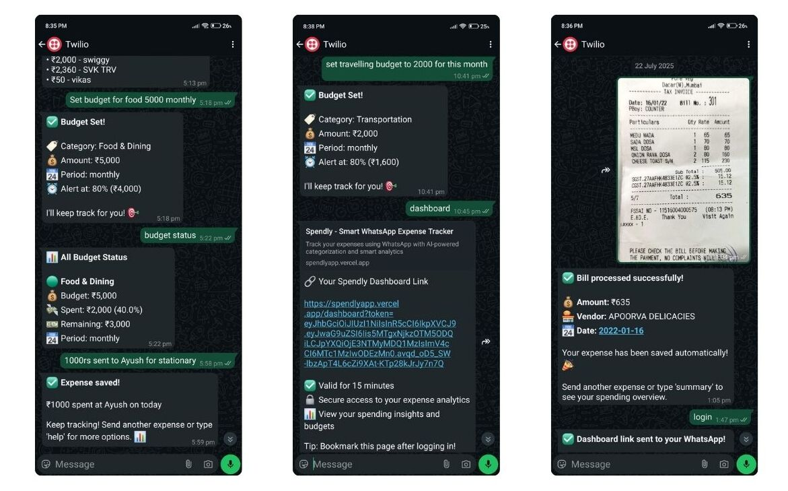

# 💸 Spendly – AI-Powered WhatsApp Expense Tracker

Spendly helps users track expenses directly through WhatsApp using natural language or receipt images. With the power of **Google Gemini**, **OCR**, and **Cloud Vision API**, Spendly intelligently extracts and categorizes spending data. A sleek **web dashboard** provides insights, analytics, and budget tracking.

🔗 [Live](https://spendly.ketankumavat.me)

---

## 📸 Demo Screenshots

<div align="center">
  
</div>

## 🚀 Features

-   ✅ **Log Expenses via WhatsApp** using plain text or receipt images
-   🧠 **AI + OCR Extraction**  
    Uses **Google Gemini API** + **Cloud Vision OCR** to extract vendor, amount, date, and items
-   📊 **Dashboard Analytics**  
    Visualize expenses, set monthly budgets, view summaries
-   🔐 **Magic Link Authentication**  
    Secure login via WhatsApp-based token system — no passwords
-   📤 **Cloudinary**  
    For secure bill/receipt image uploads and storage

---

## 🛠️ Tech Stack

| Layer        | Technologies                                              |
| ------------ | --------------------------------------------------------- |
| **Frontend** | Next.js 15, React 19, Tailwind CSS, Shadcn, Framer Motion |
| **Backend**  | Express.js, Node.js, Prisma ORM, PostgreSQL, JWT          |
| **AI & OCR** | Google Gemini API, Cloud Vision API                       |
| **Others**   | Twilio WhatsApp API, Cloudinary, NeonDB, Render           |

---

## 🌐 Bot Commands

Once you're in the sandbox:

1. **Join Bot:** [Click to Join](https://wa.me/14155238886?text=join%20hold-seed)
2. **Send Expense Examples:**
    - `200 groceries from Dmart`
    - `Bought chai for 20`
    - Upload a receipt photo (PNG/JPEG)
3. Spendly will extract and categorize the data!

---

## ⚙️ Setup Instructions

### 📦 Prerequisites

-   Node.js, npm
-   PostgreSQL or [Neon](https://neon.tech)
-   Cloudinary, Google Cloud Vision + Gemini API, Twilio credentials

### 🔑 Environment Variables

Create a `.env` in `backend/`

#### `backend/.env`

```env
DATABASE_URL=
JWT_SECRET=
TWILIO_ACCOUNT_SID=
TWILIO_AUTH_TOKEN=
TWILIO_PHONE_NUMBER=
GEMINI_API_KEY=
GOOGLE_APPLICATION_CREDENTIALS= # path to your service account JSON file
CLOUDINARY_CLOUD_NAME=
CLOUDINARY_API_KEY=
CLOUDINARY_API_SECRET=
```

---

## 🚀 Deployment

### Frontend (Vercel)

-   `npm run build && npm start`

### Backend (Render)

-   **Build Command**: `npm install`
-   **Start Command**: `npm start`

---

## 📖 AI + OCR Pipeline

1. User sends text/image on WhatsApp.
2. Image is uploaded to **Cloudinary**.
3. OCR is performed using **Google Cloud Vision API**.
4. Extracted text is sent to **Gemini API** for structured parsing.
5. Parsed data is stored in PostgreSQL via **Prisma**.
6. Web dashboard reflects updated transactions instantly.

---

## 👤 Auth Flow

-   User initiates auth via WhatsApp
-   Backend generates a **JWT magic link** for login
-   Clicking the link logs the user into their dashboard with **WhatsApp number as identifier**

---

## 🧠 Example Prompts

> "Bought lunch for ₹120 at Subway"
> "Spent 500 on books"
> "Add 30,000 to rent"

---

## ✨ Future Enhancements

-   ⏰ Reminders for recurring expenses
-   📈 Weekly spend summary via WhatsApp
-   🧾 Bulk import from bank statements
